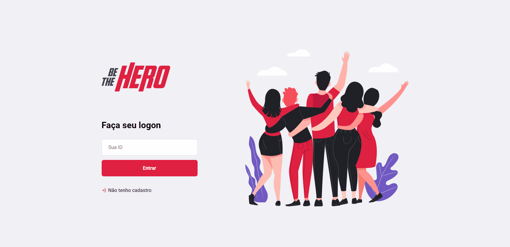

<h1 align="center">
    
</h1>

---

<blockquote align="center">
	"The only true wisdom is in knowing you know nothing."
</blockquote>

	&nbsp;&nbsp;&nbsp;&nbsp;&nbsp;&nbsp;

<h4 align="center"> 🚀✅ Semana OmniStack 11.0 🚀✅ </h4> 

  <a href="#-project">Project</a>&nbsp;&nbsp;&nbsp;|&nbsp;&nbsp;&nbsp;
  <a href="#rocket-Technologies">Technologies</a>&nbsp;&nbsp;&nbsp;|&nbsp;&nbsp;&nbsp;
  <a href="#-layout">Layout</a>&nbsp;&nbsp;&nbsp;|&nbsp;&nbsp;&nbsp;
  <a href="#memo-license">License</a>

## 🖥️ Project

Be the Hero is a fullstack project devolped during the Rocketseat's Omnistack Week 11. Using the modernest techs at the moment, I pretend
to add some features on my own in the future. The project have as it main objective connect people who
are willing to help ONGs to ONgs who need financial support.
 

 
  
  

 ## :rocket: Technologies
 
 This project was developed with the following technologies:
- [React](https://reactjs.org)
- [React Native](https://facebook.github.io/react-native/)
- [Node.js](https://nodejs.org/en/) 
- [Expo](https://expo.io/)

## 🔖 Layout

To acess the layout use the tool [Figma](https://www.figma.com/file/2C2yvw7jsCOGmaNUDftX9n/Be-The-Hero---OmniStack-11?node-id=0%3A1).

## :memo: License

This project is under the MIT license. See the [LICENSE](LICENSE.md) for details.

---
<b> </> with ❤️ by João Pedrozo. :wave: [Get in touch!](https://www.linkedin.com/in/joão-pedrozo/)</b> 
